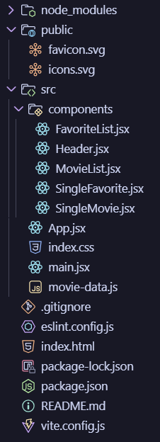

# Web Programming II Final Project Using React

This project is available to be viewed running on a live server [on Vercel](https://web-pro-ii-final-project.vercel.app/).

## Table of Contents

- [Web Programming II Final Project Using React](#web-programming-ii-final-project-using-react)
  - [Table of Contents](#table-of-contents)
  - [Part 1: Project Overview](#part-1-project-overview)
    - [File Structure](#file-structure)
    - [`package.json`](#packagejson)
  - [Part 2: Code Analysis](#part-2-code-analysis)
    - [`main.jsx`](#mainjsx)
    - [`App.jsx`](#appjsx)
      - [Dependencies](#dependencies)
      - [States](#states)
      - [Functions](#functions)
        - [`isInFavorites`](#isinfavorites)
        - [`addToFavorites`](#addtofavorites)
        - [`removeFromFavorites`](#removefromfavorites)
      - [Returns](#returns)
    - [`Header.jsx`](#headerjsx)
      - [Dependencies](#dependencies-1)
      - [Functionality](#functionality)
    - [`FavoriteList.jsx`](#favoritelistjsx)
    - [`SingleFavorite.jsx`](#singlefavoritejsx)
    - [`MovieList.jsx`](#movielistjsx)
      - [Dependencies](#dependencies-2)
      - [Functionality](#functionality-1)
      - [Returns](#returns-1)
    - [`SingleMovie.jsx`](#singlemoviejsx)
    - [`index.css`](#indexcss)
    - [`index.html`](#indexhtml)
  - [Part 3: Conclusion](#part-3-conclusion)

## [Part 1: Project Overview](#table-of-contents)

### [File Structure](#table-of-contents)
Here is my project’s file structure. Note that inside of the `src` folder, I have a components folder, in addition to the `App.jsx`, `index.css`, `main.jsx`, and `movie-data.js` files. Inside the `components` folder are each of the five components I used to recreate the markup in the example file: `FavoriteList.jsx`, `Header.jsx`, `MovieList.jsx`, `SingleFavorite.jsx`, and `SingleMovie.jsx`.



### `package.json`

The contents of my [`package.json`](./package.json) are as follows:
```
{
  "name": "webpro2finalproject",
  "private": true,
  "version": "0.0.0",
  "type": "module",
  "scripts": {
    "dev": "vite",
    "build": "vite build",
    "lint": "eslint .",
    "preview": "vite preview"
  },
  "dependencies": {
    "react": "^19.2.6",
    "react-dom": "^19.2.6"
  },
  "devDependencies": {
    "@eslint/js": "^10.0.1",
    "@types/react": "^19.2.14",
    "@types/react-dom": "^19.2.3",
    "@vitejs/plugin-react": "^6.0.1",
    "eslint": "^10.3.0",
    "eslint-plugin-react-hooks": "^7.1.1",
    "eslint-plugin-react-refresh": "^0.5.2",
    "globals": "^17.6.0",
    "vite": "^8.0.12"
  }
}
```

You'll notice that it only requires `react` and `react-dom` for non-development builds.

## [Part 2: Code Analysis](#table-of-contents)

### [`main.jsx`](#table-of-contents)

```
import { StrictMode } from 'react'
import { createRoot } from 'react-dom/client'
import './index.css'
import App from './App.jsx'

createRoot(document.getElementById('root')).render(
  <StrictMode>
    <App />
  </StrictMode>,
)
```
My [`main.jsx`](./src/main.jsx) file is a very standard entry point for a React project. Very little (if anything) was changed in this file.

### [`App.jsx`](#table-of-contents)

```
//= laz r
//= 05-26-2026 17:10
//= App.jsx

//= Dependencies =//
import { useState, useEffect } from 'react'
import Header from './components/Header.jsx';
import MovieList from './components/MovieList.jsx';
import movieDataList from './movie-data.js';

function App() {
  const [movies, setMovieData] = useState(movieDataList);
  const [favorites, setFavorites] = useState([]);

  const isInFavorites = (id) => {
    const inFavorites = favorites.find(m => m.id == id);
    if (inFavorites) return true;
    else return false;
  }

  const addToFavorites = (id) => {
    const movieAdd = movies.find(m => m.id == id);
    if (favorites.find(m => m.id == id)) return;
    setFavorites([...favorites, movieAdd]);
  }

  const removeFromFavorites = (id) => {
    const newFavorites = favorites.filter(m => m.id != id);
    setFavorites(newFavorites);
  }

  return (
    <main className="section">
      <article className="container">
        <Header data={favorites} update={removeFromFavorites} />
        <MovieList data={movies} add={addToFavorites} remove={removeFromFavorites} check={isInFavorites} />
      </article>
    </main>
  )
}

export default App;
```

#### Dependencies
[`App.jsx`](./src/App.jsx) requires importing `useState` and `useEffect` from `react`, as well as importing two of my components ([`Header.jsx`](./src/components/Header.jsx) and [`MovieList.jsx`](./src/components/MovieList.jsx)) and the movie data array stored in [`movie-data.js`](./src/movie-data.js).

#### States
At the top of App, I set two states: `movies` & `favorites`. Each of these is an array of objects representing movies to be displayed. `movies` is initialized to the value of the imported array, and `favorites` is initialized to an empty array.

#### Functions
I then define three functions to be passed as props: `isInFavorites`, `removeFromFavorites`, and `addToFavorites`, all three of which take one argument: `id`.

##### `isInFavorites`
This function checks the favorites list for an item with an id that matches the id passed to the function. If one exists, it returns `true`; if not, it returns `false`.

##### `addToFavorites`
This function first finds the movie object that corresponds to the `id` argument. Then, it checks the favorites list to see if this movie is already in there. If it is, the function returns. Otherwise, it calls `setFavorites` with an argument of `[...favorites, movieAdd]`, which is the existing favorites list with `movieAdd` appended.

##### `removeFromFavorites`
This function creates a copy of the favorites list (without the movie to be removed) by filtering it using the `id` argument. If there is no object with that `id`, it just returns the existing list. Then it calls `setFavorites` with this copy as the argument.

#### Returns

`App.jsx` returns a `<main>` element, containing a `<section>` element. The `<section>` element in turn contains a `<Header>` component and a `<MovieList>` component, each passed their own respective props.

`<Header>` is passed `favorites` and `removeFromFavorites` as `data` and `update`, respectively.

`<MovieList>` is passed `movies`, `addToFavorites`, `removeFromFavorites`, & `isInFavorites` as `data`, `add`, `remove`, & `check`, respectively.

### [`Header.jsx`](#table-of-contents)

```
//= laz r
//= 05-26-2026 17:10
//= Header.jsx

//= Dependencies =//
import FavoriteList from "./FavoriteList.jsx";

const Header = (props) => {
    return (
        <section className="favorites">
            <FavoriteList data={props.data} update={props.update} />
        </section>
    )
}

export default Header;
```

#### Dependencies
[`Header.jsx`](./src/components/Header.jsx) requires importing only `FavoritesList` from [`FavoritesList.jsx`](./src/components/FavoriteList.jsx).

#### Functionality

This component is essentially just a wrapper for the `FavoritesList` component, passing the props through to it and returning it wrapped in a `<section>` element. In a bigger project, it might contain other content, such as a topbar or similar.

### [`FavoriteList.jsx`](#table-of-contents)

### [`SingleFavorite.jsx`](#table-of-contents)

### [`MovieList.jsx`](#table-of-contents)

```
//= laz r
//= 05-26-2026 17:10
//= MovieList.jsx

//= Dependencies =//
import SingleMovie from "./SingleMovie.jsx";

const MovieList = (props) => {
    return (
        <>
            <h2 className="title">Browse</h2>
            <ul className="columns is-multiline">
                {props.data.map((m, i) => <SingleMovie movie={m} key={i} add={props.add} remove={props.remove} check={props.check} />)}
            </ul>
        </>
    )
}

export default MovieList;
```

#### Dependencies

[`MovieList.jsx`](./src/components/MovieList.jsx) requires importing [`SingleMovie`](#singlemovie) from [`SingleMovie.jsx`](./src/components/SingleMovie.jsx).

#### Functionality

Similarly to [`Header`](#headerjsx), `MovieList` does not define any of its own states or functions. However, `MovieList` *does* iterate through each item in the list passed as the `data` prop, creating a `SingleMovie` component from each item. It passes the movie object itself as `movie` and each of the three functions passed to it by `App` (`addToFavorites`, `removeFromFavorites`, & `isInFavorites` as `add`, `remove`, & `check`, respectively).

#### Returns

This component returns an `<h2>` element and the list of `<SingleMovie>` components wrapped in an empty tag.

### [`SingleMovie.jsx`](#table-of-contents)

```
//= laz r
//= 05-26-2026 17:10
//= SingleMovie.jsx

//= Dependencies =//
import { useEffect, useState } from 'react';

const SingleMovie = (props) => {
    const [isAFavorite, setIsAFavorite] = useState(false);

    useEffect(() => {
        setIsAFavorite(props.check(props.movie.id));
    });

    const handleClick = (e) => {
        if (isAFavorite) {
            props.remove(props.movie.id);
        }
        props.add(props.movie.id);
    }

    return (
        <li className="column is-one-fifth-desktop">
            <div className="card">
                <div className='card-image'>
                    <figure className="image is-2by3">
                        
                    </figure>
                </div>
                <div className="card-content has-text-centered content-rectangle">
                    <h2 className="title is-5">{props.movie.title}</h2>
                    <p className="is-size-7">{props.movie.description}</p>
                </div>
                <footer className='card-footer'>
                    <button
                        className={isAFavorite ? `button card-footer-item heartButton fave` : `button card-footer-item heartButton`}
                        onClick={handleClick}>
                        <svg className="w-5" xmlns="http://www.w3.org/2000/svg" width="1em" height="1em" viewBox="0 0 24 24">
                            <path d="M0 0h24v24H0z" fill="none" />
                            <path fill="currentColor"
                                d="m12 21.35l-1.45-1.32C5.4 15.36 2 12.27 2 8.5C2 5.41 4.42 3 7.5 3c1.74 0 3.41.81 4.5 2.08C13.09 3.81 14.76 3 16.5 3C19.58 3 22 5.41 22 8.5c0 3.77-3.4 6.86-8.55 11.53z" />
                        </svg>
                    </button>
                </footer>
            </div>
        </li>
    )
}

export default SingleMovie;
```

### [`index.css`](#table-of-contents)

### [`index.html`](#table-of-contents)

## [Part 3: Conclusion](#table-of-contents)
